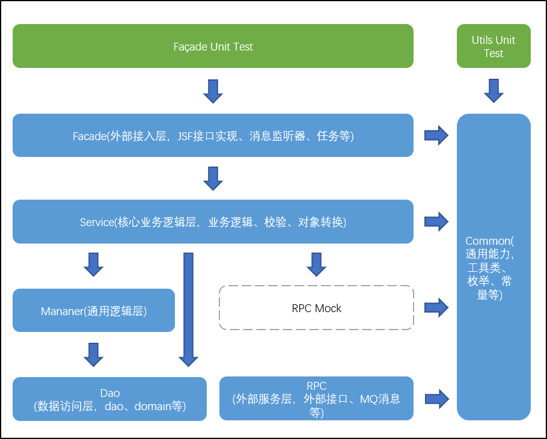

# 前言

最近一年多来，我们团队在单元测试方面进行了一系列的实践，并且取得了不错的效果。我计划写一系列单元测试相关的文章，以总结我们这段时间的单元测试实战经验，同时希望对大家有所启发。

大多数研发都能认识到单元测试是有价值的，但又觉得耗费时间精力，单元测试是需要持续做的，但又只想投入较少的成本。我写这个系列文章就是想探讨一下怎么样做单元测试才有效率有效果的。**首先，我想从重新认识单元测试的角度入手**，一起讨论一些关于单元测试的老生常谈的问题，**接着会分享一些具体的实践内容，比如引入Spock单元测试框架简化单元测试，自动生成单元测试工具选型和接入行云流水线等**，希望通过这些内容能帮助大家有效落地单元测试。

作为这个系列的首篇文章，本文不会花大量篇幅介绍单元测试的定义、价值、规范以及诸如测试金字塔理论、3A原则、AIR原则、BCDE原则之类的内容，大家利用搜索引擎可以快速获知。

# 重识单元测试

在准备分享前，读到了 Martin Fowler 的一篇文章[《UnitTest》](https://martinfowler.com/bliki/UnitTest.html)，发现其中表达的一些观点与我们的实践经验竟基本一致，这篇文章整体就是在讲如何根据实际情况和需求进行有效的单元测试。接下来我会参考这篇文章并结合我们的实践经验**从单元测试的单元粒度，单元测试是否需要模拟全部依赖以及单元测试的速度几个方面探讨如何进行有效的单元测试。**

## 选择适当的单元粒度

首先，第一个问题是，单元测试中的"单元"是指什么呢？这个问题应该没有标准答案，一般而言，对于面向过程的编程，可以将单个函数作为单元；而面向对象的设计则倾向于将类作为单元。每个团队可以根据他们对系统及测试目的的理解来决定什么才是有意义的单元。

我们团队通常将一组密切相关的类作为一个单元，将测试的重点放在对JSF接口、消息监听器、定时任务、Controller方法等入口类和工具类的测试上，并不是工程中每个类都写单元测试。测试过程中，从入口类进行的单元测试会真实地调用整个调用链上不同层级的类，每个入口类及其执行过程中贯穿的多个类就是我们的测试单元，也可以说我们通常将一个功能模块中的类当作测试单元。这样做跟我们的工程结构也有一定关系，我们的工程结构是比较传统的分层结构，核心的业务逻辑集中在Service层，其他层则相对较薄没有特别复杂的逻辑，如果对每个类都进行单元测试，投入的工作量巨大，而且并不是每个类都有单独做单元测试的必要，即使做了，对于整体代码质量的提升也并不明显，而通过对入口类以及关键工具组件进行单元测试，我们也可以全面地覆盖代码，确保其质量，测试场景充分的情况下，这样已经能覆盖到60\%左右的代码了。

**一般情况下，我们主要针对入口类和工具类做单元测试，不过这也不是一条铁律，你可以针对任何你觉得应该测试的地方进行测试。**

## 模拟不稳定依赖

另一个问题是，对于被测单元的依赖，我们可以选择直接调用真实的依赖，也可以mock依赖让被测单元调用，那么，是不是所有的真实依赖都需要通过mock隔离开呢？有些文章会告诉我们单元测试应该模拟所有依赖，这是单元测试区别于集成测试的一个特征。让我们以一个查询订单价格的接口为例来思考一下，假设这个接口依赖产品和用户服务。

如果被测单元依赖产品和用户的服务是RPC服务，RPC服务在测试环境通常不稳定，那么我们最好采用mock方式。通过模拟外部服务的响应，我们可以更好地控制测试环境，避免受到不稳定服务的影响。这样可以确保测试的独立性和可重复性。

但是，如果被测单元依赖的产品和用户服务是同一个工程中的类（假设订单、产品、用户的Service、Manager、Dao类都在一个工程），并且这些依赖类总能稳定地返回所需的响应，那么还有必要进行mock吗？我们团队的做法是只mock那些不稳定的依赖，对于同一工程内的稳定依赖则直接调用。这样可以减少mock的使用频率，同时也能更好地保持测试的实际场景。

**决定是使用真实的依赖还是进行mock的关键因素是依赖的可靠性和稳定性。如果依赖是一个未经充分测试或不可靠的服务，或者会对测试结果产生意外影响（这类依赖通常包括系统时间、数据库、中间件和依赖网络的接口调用等），那么这种场景下采用mock是个不错的选择**。但是对于可靠且经过验证的依赖，直接使用真实的依赖可能更符合实际情况，同时也能减少一定的工作量。

## 执行单元测试的速度

一般开发人员都希望测试能够快速执行。快速执行意味着我们可以频繁运行单元测试，及时发现新增的代码是否破坏了之前的功能。但是，什么样的执行速度算得上是快呢？由于不同的人对速度的接受程度有所不同，所以这个问题没有一个明确的答案。

有些团队为了追求单元测试执行速度会去除容器，但这样做又引入了另一个问题，那就是我们需要手动处理依赖关系。特别是当一个类有很多依赖时（在一些业务系统中一个类依赖十几个甚至二十几个类的情况并不罕见），这个工作量就会很大。所以我们在实践中依旧使用容器运行单元测试，但同时屏蔽了一些非必要的加载项，比如JSF和JMQ等中间件，因为外部不稳定依赖会被mock，所以没有必要再加载。这样，我们能够在保留Spring容器的前提下提升测试的速度。

我们还接入了流水线来自动执行单元测试。实际上，我发现我们的单元测试速度是可以接受的，126秒能够执行完668个测试用例。这种速度能够满足我们对于快速反馈的需求。最重要的是，流水线还有提交代码触发执行单元测试，执行完成后消息通知的机制，所以我们甚至都不需要关注执行的速度，提交完代码接着干别的事情就好了，单元测试执行完就能收到消息通知。

# 总结

文中探讨的测试方式还是单元测试吗？如果单元外的依赖可以正常工作，不进行模拟直接调用真实依赖，这样的测试使用"单元测试 "一词是恰当的，因为这种测试依旧是对单个单元行为的测试，而单个单元也可以是一组密切相关的类。因此，测试仍然符合单元测试的定义和目标。

单元测试是一个工具，一个可以帮助我们把代码写的更好、更健壮的性价比最高的工具，我们可以根据实际情况进行有效的单元测试。