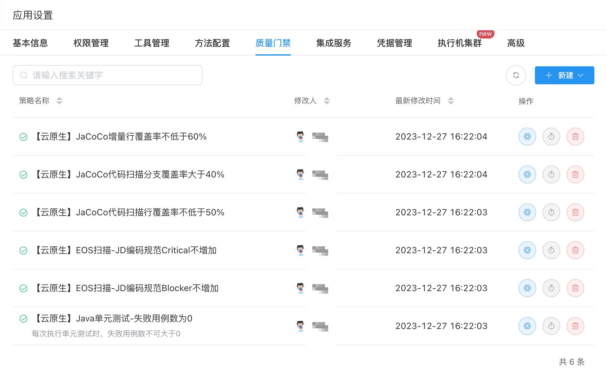
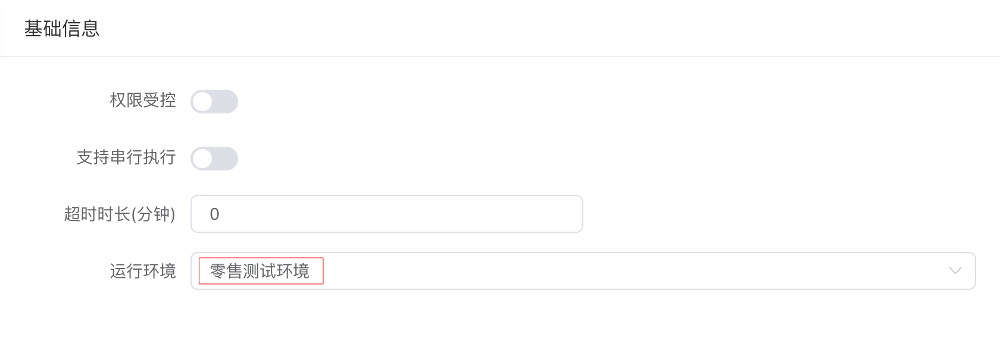
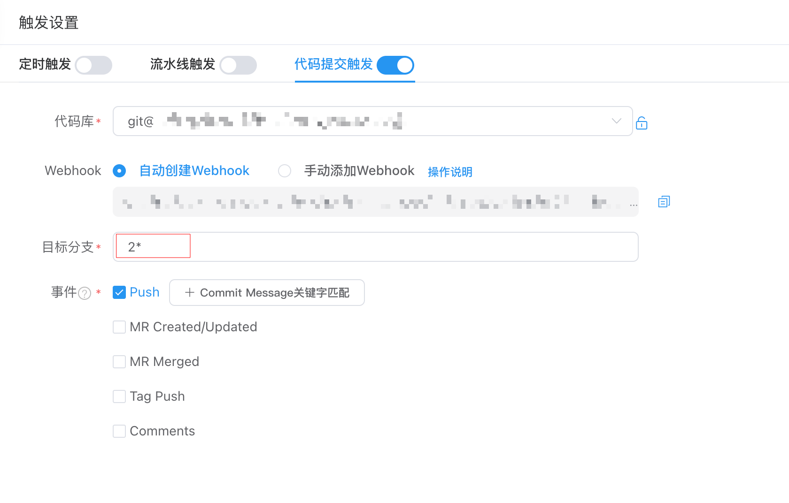
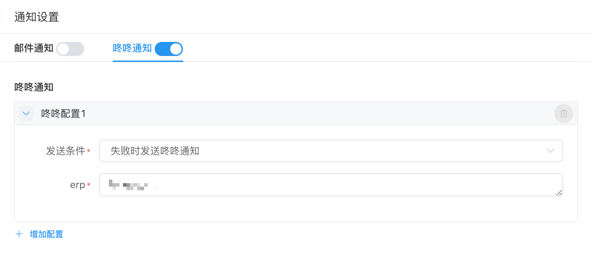

在当今快速变化的软件开发领域，流水线自动化执行单元测试已成为确保代码质量、加速产品交付并维持高效开发流程的一项重要实践。流水线自动化执行单元测试，不仅能及时发现并解决问题，还能显著提高开发团队的工作效率和对产品的信心。本文将重点介绍如何通过整合行云流水线来自动化执行单元测试，并收集和统计代码覆盖率相关数据。

接入行云流水线后，开发流程将会是这样的，当开发人员完成某个模块的代码开发并提交至远程代码仓库后，提交操作将自动触发流水线执行全部单元测试。若流水线的质量门禁检查未通过，系统会立即通知相关开发人员。此时，开发人员需要根据反馈修改代码，并重新执行单元测试，直至所有测试通过。这样的流程确保了通过单元测试发现的问题能够被及时解决。

在整个开发周期中，团队持续监控单元测试的各项指标，特别是代码覆盖率，这一指标对于我们识别未测试到的代码区域至关重要，从而指导我们进行改进。需要注意的是，虽然代码覆盖率是一个重要的指标，但它并不能全面代表测试的质量。覆盖率指标是一个相对客观且易于量化的标准。参照谷歌的最佳实践，60%的代码覆盖率被认为是基本的可接受水平，75%则表示良好的测试实践，值得鼓励，而达到90%则代表达到了卓越的测试标准。

## 单元测试接入流水线平台步骤

为了接入行云流水线，我们首先需要在工程中添加相应的Maven插件配置，确保我们的构建过程能够与行云流水线平台无缝对接。接下来，在流水线平台上创建应用并配置相关参数，这一步骤将为流水线的执行提供必要的应用和代码仓库等信息。然后，我们需要创建流水线，定义其各个阶段的任务，包括下载代码、代码编译、自动测试、JaCoCo代码覆盖率等。创建完成后，我们执行流水线，最后，我们应当重点关注流水线中单元测试的数据输出，这些数据不仅能帮助我们评估代码质量，还能为后续的开发和改进提供指导性的反馈。通过这些步骤，我们能够确保软件交付流程的自动化、高效化和规范化，进一步提升开发和测试的效率。


## Java 服务端工程配置

### 插件配置

为了方便流水线平台能够快速统计到单测及覆盖率的数据，需要在工程**根目录 pom 文件**配置如下插件。

```xml
<build>
    <plugins>
        <plugin>
            <groupId>org.apache.maven.plugins</groupId>
            <artifactId>maven-surefire-plugin</artifactId>
            <version>2.22.2</version>
            <configuration>
                <testFailureIgnore>true</testFailureIgnore>
                <includes>
                    <include>com/**/*Test.java</include><!-- 这里可以根据实际情况调整路径 -->
                    <include>com/**/*Test.groovy</include>
                </includes>
                <excludes>
                    <exclude>com/**/rpc/**/*Test.java</exclude><!-- 这里可以根据实际情况配置不需要执行的单元测试，因为rpc层通常会被mock，此层测试用例通常用来试一下外部接口是否按预期返回响应 -->
                    <exclude>com/**/rpc/**/*Test.groovy</exclude>
                </excludes>
            </configuration>
        </plugin>
        <plugin>
            <groupId>org.apache.maven.plugins</groupId>
            <artifactId>maven-surefire-report-plugin</artifactId>
            <version>2.22.2</version>
        </plugin>
    </plugins>
</build>
```

如果需要在本地通过JaCoCo跑单元测试覆盖率可以再增加JaCoCo插件配置，实践过程中我们没有直接在工程中添加JaCoCo插件配置，流水线依然可以跑出覆盖率。

```xml
<build>
    <plugins>
        <!-- 生成JaCoCo覆盖率数据插件 -->
        <plugin>
            <groupId>org.jacoco</groupId>
            <artifactId>jacoco-maven-plugin</artifactId>
            <version>0.8.2</version>
            <executions>
                <execution>
                    <goals>
                        <goal>prepare-agent</goal>
                    </goals>
                </execution>     <!-- attached to Maven test phase -->
                <execution>
                    <id>report</id>
                    <phase>test</phase>
                    <goals>
                        <goal>report</goal>
                    </goals>
                </execution>
            </executions>
        </plugin>
    </plugins>
</build>
```

### 本地调试

本地通过命令行执行命令，运行单元测试，也可以直接通过idea中的maven工具执行单元测试。

```shell
mvn clean test -Dmaven.test.failure.ignore=true
```

## 在行云流水线创建应用

### 创建应用

接入行云流水线前需要先创建系统和应用，首页点击左上角的创建应用即可、应用类型请选择**服务端(含前端)，**创建方式可以选择**从JDOS平台导入，需要提前在Coding 平台代码库为公共账号（xn_testdev_ci）赋予 guest 及以上权限。


### 设置应用质量门禁

添加质量门禁是为了后面创建流水线时可以打开质量门禁，当然也可以跳过此步骤先创建流水线，需要时再添加质量门禁。


点击右上角应用设置。在 质量门禁-新建-平台策略 添加团队关注的质量门禁策略。如添加 Java单元测试-失败用例数为0，当后续配置的流水线选择开启这个质量门禁，某次提交代码导致有失败的测试用例出现时，这次提交就不会通过质量门禁检测。



## 创建单元测试流水线

### 创建流水线

在应用中，点击右上角**新建流水线**按钮，选择**传统**执行模式，从流水线模版复制。可从流水线提供的系统模板中选则团队需要的流水线。


选择模板后，还可以继续添加其他原子，比如我们可以再添加JaCoCo增量覆盖率。


流水线的原子支持拖拽，我们可以拖拽EOS扫描原子，使其和单元测试并行执行。

### 环境的选择

我们还需要配置单元测试执行的环境，在 新建/配置流水线-基础信息 选择**测试环境**。



### 提交代码时触发流水线

要想在每次提交代码时触发流水线自动执行单元测试，我们可以在 新建/配置流水线-触发设置-代码提交触发 中开启开关，选择自动创建Webhook，选择Push时触发，可以通过特定Commit Message来触发，比如提交信息中有fix或build时才触发流水线执行，还可以配置特定分支Push时触发。



### 打开质量门禁

我们可以根据需要点击流水线原子，打开之前在应用设置中配置的质量门禁。例如下图中打开了JaCoCo代码覆盖率的门禁，当然你还可以根据情况打开EOS扫描、单元测试、JaCoCo增量覆盖率的门禁。


### 发送通知

如果需要在质量门禁检测不通过的时候通知到相关的开发人员，可以在 新建/配置流水线-通知设置-咚咚通知 配置通知的erp。



### 排除类路径

可以配置**ExclusionClass**排除某些类的统计，这样在统计单元测试数据时就不会包含这些类。


| 排除情况                                                  | 示例参数                              |
|-------------------------------------------------------|-----------------------------------|
| 希望排除 projectName/moduleName/packageName/及子包下的所有代码     | `**/com/jd/example/**`            |
| 希望排除 projectName/moduleName/packageName/及子包下的所有代码     | `**/com/jd/example/**/*.class`    |
| 希望排除 projectName/moduleName/packageName/ 下所有代码（不包括子包） | `**/com/jd/example/*.class`       |
| 希望排除某一具体代码类                                           | `**/com/jd/example/example.class` |
| 希望排除某一模块下所有代码类                                        | `**/moduleName/**`                |
| 希望排除某一模块下引入的 jar 包                                    | `**/jarName.jar`                  |

### 配置hosts

如果单元测试需要配置hosts，可以点击 阶段编排中 的 单元测试节点 配置。


## 配置应用

### 设置应用度量源

可以在 应用设置-基础信息 设置度量源，流水线次日会收集指标数据，可以在数据统计中看到统计数据。


### 添加应用核心方法

可以在 应用设置-方法配置 根据团队需要添加核心方法，可以在覆盖率报告中单独关注核心方法的指标。


## 查看单测及覆盖率报告

配置完流水线后点击运行流水线，流水线运行成功后，可在运行报告处看到本次运行的详细数据。


## 数据统计

流水线每天会统计指标数据，可以在数据统计中查看。

如果只关注系统数据，可以在数据统计-系统视图-选择系统查看。


## 总结

本文详细介绍了如何利用行云流水线自动化执行单元测试，自动化流水线为开发团队提供了一个高效的质量保证流程。通过自动化流水线，研发人员可以即时获得单元测试结果和质量反馈，确保代码质量。 开发团队可以参考本文轻松地搭建起一套完整的单元测试流水线，从而持续监控和提升测试质量，最终推动软件项目的高质量交付。