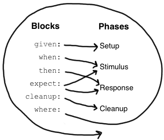

# 前言

在日常开发中，我们会经手一些项目，这些项目要么缺少单元测试，要么通过在 main 方法中编写代码并直接查看输出结果来进行不规范的测试，要么单元测试能覆盖到的代码极少。这些情况通常是由于开发人员没有形成良好的开发习惯，因为代码逻辑复杂、编写单元测试繁琐且耗时而不重视单元测试。核心问题是单元测试的质量和效率不佳。我们团队在多个项目中引入Spock测试框架做单元测试，改善了单元测试质量效率低的问题，取得了不错的效果。Spock有以下几个突出的优势和特性，相信大家一旦使用Spock，也会有一种相见恨晚的感觉。

* 结构清晰简洁：Spock 提供了清晰、简洁的语法，使得单元测试代码更易读、易理解。其使用BDD（Behavior Driven Development，行为驱动开发）风格的 `given-when-then`结构，这种清晰的语法是JUnit不具备的。
* 数据驱动测试：Spock 支持数据驱动测试，通过数据表的方式，可以轻松地对多组输入进行测试，减少了冗余的测试代码，提高代码覆盖率。使用JUnit虽然可以通过参数化注解或DataProvider机制对多组输入进行测试，但Spock的数据驱动方式更为直观和简洁，从而使得维护工作变得更加容易。
* 强大的断言支持：Spock 提供了丰富的断言方法，可以灵活地进行各种验证和比较，从而更全面地覆盖被测试代码的各种情况。尽管JUnit提供了断言API，但Spock使用条件表达式完成断言的方式更为简单。Spock也可以配合Hamcrest使用以增强测试能力。
* 自带模拟与交互验证：Spock 提供了灵活而强大的模拟框架，可以方便地进行对象的模拟和交互验证。JUnit在使用时通常需要搭配Mockito、EasyMock等工具来实现mock功能，而这些工具的语法相对复杂，相比之下，Spock内置的mock语法更为简洁和直观。
* 基于动态语言：此外，Spock 还基于 Groovy 语言，使得编写单元测试更加简洁，可以提高编写单元测试代码的效率。

一图胜千言。让我们通过一张截图来直观感受下Spock的简洁和高效。


本文中的部分示例见[GitHub](https://github.com/howiefh/spock-example)。

这篇文章将结合[Spock文档](https://spockframework.org/spock/docs/2.3/index.html)及实践经验介绍Spock测试框架。

# Spock入门

> Spock 是 Java 和 Groovy 应用程序的测试和规范框架。它之所以能在众多框架中脱颖而出，是因为它既美观又极具表现力的规范语言。得益于 JUnit runner，Spock 可与大多数集成开发环境、构建工具和持续集成服务兼容。Spock 的灵感来自 JUnit、RSpec、jMock、Mockito、Groovy、Scala、Vulcans 等。

## 了解Groovy

由于Spock是基于Groovy语言的，需要先粗略了解一下 Groovy的语法，不过Groovy兼容Java的绝大多数语法，上手非常容易。如果想了解Groovy跟Java的差异可以访问 [https://groovy-lang.org/differences.html](https://groovy-lang.org/differences.html)。

## 添加依赖

截止目前Spock最新版本Maven坐标是`org.spockframework:spock-spring:2.4-M1-groovy-2.5`。为了maven能正常编译Groovy文件，还应该添加Plugin，Maven坐标是`org.codehaus.gmavenplus:gmavenplus-plugin:3.0.2`。

示例：[pom.xml](https://github.com/howiefh/spock-example/blob/master/pom.xml)。

## 声明测试类

```groovy
class MyFirstTest extends Specification {
  // 字段
  // 固定方法
  // 测试方法
  // 辅助方法
}
```

测试类需要继承 `spock.lang.Specification`，Spock文档示例中测试类以`Spec`结尾，但是我们通常还是习惯将测试类的名称以`Test`作为后缀。

## 字段

Spock测试类字段有实例字段、共享字段、静态字段三种。实例字段（非共享字段或静态字段）不可以在固定方法 `setupSpec()`和`cleanupSpec()` 中使用，这两方法中只能使用共享字段或静态字段。实例字段在固定方法和测试方法中使用时对每个测试用例（注意是每个测试用例，一个测试方法可能有多个用例，`where`表格，每一行就是一个用例）而言都是重新初始化的，因此不能在不同的测试用例间共享。如果需要共享可以使用共享字段，即加`@Shared`注解。静态字段只应该用作常量。需要在测试用例间共享时最好使用共享字段（虽然静态字段也能在测试用例间共享，但共享字段的语义更加明确）。

```groovy
def coll = new Collaborator() // 实例字段
@Shared res = new VeryExpensiveResource() // 共享字段
static final PI = 3.141592654 // 静态字段
```

## 固定方法

```groovy
def setup() {}          // 每个测试用例开始前都会执行一遍
def cleanup() {}        // 每个测试用例后都会执行一遍
def setupSpec() {}     // 在第一个测试方法开始前执行一遍
def cleanupSpec() {}   // 最后一个测试方法后执行一遍
```

固定方法负责设置和清理运行测试用例的环境。

### 执行顺序

1. `super.setupSpec`
2. `sub.setupSpec`
3. `super.setup`
4. `sub.setup`
5. 测试方法
6. `sub.cleanup`
7. `super.cleanup`
8. `sub.cleanupSpec`
9. `super.cleanupSpec`

示例：[InvocationOrderTest.groovy](https://github.com/howiefh/spock-example/blob/master/src/test/groovy/io/github/howiefh/spock/example/InvocationOrderTest.groovy)

## 测试方法

```groovy
def "pushing an element on the stack"() {
  // 不同的块
}
```

测试方法名是一个字符串，也是对测试方法的描述。

从概念上讲，测试方法包括四个阶段：

1. Setup：初始化测试环境（可选）
2. Stimulus：调用受测方法
3. Response：描述预期响应
4. Cleanup：清理测试环境（可选）

### 块

Spock将测试方法结构化成所谓的块，内置支持了这四个概念上的阶段。块从一个标签开始直至另一个标签开始或方法结束。有6种块：`given`，`when`，`then`，`expect`，`cleanup`，`where`。从方法的开头到第一个显式块之间的所有语句都属于隐式的 `given` 块。

一个测试方法必须至少有一个显式块（即方法里至少有一个块才会被当做测试方法）。块不能嵌套。

下图是块和四个概念阶段的对应关系



#### given 块

```groovy
given:  // 对当前测试方法的环境进行初始化
def stack = new Stack()
def elem = "push me"
```

在`given`块中应对当前测试方法的环境进行初始化。该代码块之前不能有其他代码块，也不能重复。该代码块没有任何特殊语义。`given:`标签可以省略。别名`setup`，但`given`可读性会更好。

#### when 和 then 块

```groovy
when:   // 调用待测代码
then:   // 描述期望的响应
```

`when`和`then`块总是同时出现，这两个块组合在一块使用可以调用待测代码并指定期望的响应。`when`块可以包含任意代码，但是`then`中仅限于布尔表达式，异常条件，交互和变量定义语句。一个测试方法可以有多个`when-then`块。注意`then`块不宜过于庞大，尽量控制在5个语句之内。

Spock可以不使用类似JUnit的断言API，如`assertEquals(a, b)`，而使用布尔表达式做断言，实际上也可以是非布尔值，Groovy可以将其他类型推理为布尔值。

示例：[ConditionsTest.groovy](https://github.com/howiefh/spock-example/blob/master/src/test/groovy/io/github/howiefh/spock/example/ConditionsTest.groovy)

```groovy
when:
stack.push(elem)

then:
!stack.empty
stack.size() == 1
stack.peek() == elem
```

如果断言失败，Spock给出的反馈也非常容易理解

```groovy
Condition not satisfied:

stack.size() == 2
|     |      |
|     1      false
[push me]
```

##### 异常条件

异常条件用于描述`when`块中是否应该抛出异常，使用 `thrown()` 方法定义，方法参数是异常类型。例如，要描述从空堆栈弹出时应抛出 `EmptyStackException`，可以写如下内容：

```groovy
when:
stack.pop()

then:
thrown(EmptyStackException)
stack.empty
```

异常条件后可以跟其他条件和其他块。想要访问异常的属性或方法，需要将其绑定到一个变量：

```groovy
when:
stack.pop()

then:
def e = thrown(EmptyStackException)
e.cause == null
```

或者另一种写法：

```groovy
when:
stack.pop()

then:
EmptyStackException e = thrown()
e.cause == null
```

推荐第二种写法，强类型便于开发环境提供代码补全，并且可读性更强。

有时，我们期望不应该抛出异常。例如， `HashMap` 应接受`null`键：

```groovy
def "HashMap accepts null key"() {
  given:
  def map = new HashMap()

  when:
  map.put(null, "elem")

  then:
  notThrown(NullPointerException)
}
```

通过`notThrown()`可以更明确地表明不期望抛出`NullPointerException`异常。不过，如果抛出其他异常，该方法也会失败。

##### 交互

条件描述的是对象的状态，而交互描述的是对象间如何相互通信。进阶篇会具体讲，这里仅举个例子，假设我们要描述从发布者到订阅者的事件流。

示例：[InteractionsTest.groovy](https://github.com/howiefh/spock-example/blob/master/src/test/groovy/io/github/howiefh/spock/example/InteractionsTest.groovy)

```groovy
def "events are published to all subscribers"() {
  given:
  def subscriber1 = Mock(Subscriber)
  def subscriber2 = Mock(Subscriber)
  def publisher = new Publisher()
  publisher.add(subscriber1)
  publisher.add(subscriber2)

  when:
  publisher.fire("event")

  then:
  1 * subscriber1.receive("event")
  1 * subscriber2.receive("event")
}
```

#### expect 块

`expect`块可以看成是`when-then`块的简化版，但是它只能包含布尔表达式和变量定义（不能有异常条件和交互）。

例如，测试`Math.max()`方法：

```groovy
when:
def x = Math.max(1, 2)
then:
x == 2
```

```groovy
expect:
Math.max(1, 2) == 2
```

两种是等效的，明显第二种更简洁。

#### cleanup 块

```groovy
given:
def file = new File("/some/path")
file.createNewFile()

// ...

cleanup:
file.delete()
```

`cleanup`块后面只可以有`where`块，cleanup块用于清理当前测试方法使用的资源。即使测试产生了异常也会执行。

如果一个测试类的所有测试方法都需要相同的资源，那么可以使用 `cleanup()` 方法；否则，最好使用`cleanup`块。同样的也适用于 `setup()` 方法和`given` 块。

#### where 块

`where`块一定是放在方法的最后，且不能重复。它用于写数据驱动的测试方法。例如：

```groovy
def "computing the maximum of two numbers"() {
  expect:
  Math.max(a, b) == c

  where:
  a << [5,3]
  b << [1,9]
  c << [5,9]
}
```

另一种写法

```groovy
def "computing the maximum of two numbers"() {
  expect:
  Math.max(a, b) == c

  where:
  a | b || c
  5 | 1 || 5
  3 | 9 || 9
}
```

`where`块为当前的测试方法创建了两个测试用例，一个用例 a 是 5，b 是 1，c 是 5；另一个 用例a 是 3，b 是 9，c 是 9。

虽然`where`块是最后声明的，但却是第一个执行的。在进阶篇会详细讲解数据驱动测试。

## 辅助方法

当初始化或清理测试环境，条件判断比较复杂，包含大量可以复用的代码时，可以引入辅助方法。

```groovy
def "offered PC matches preferred configuration"() {
  when:
  def pc = shop.buyPc()

  then:
  matchesPreferredConfiguration(pc)
}
void matchesPreferredConfiguration(pc) {
  assert pc.vendor == "Sunny"
  assert pc.clockRate >= 2333
  assert pc.ram >= 4096
  assert pc.os == "Linux"
}
```

需要注意两点，首先必须使用`assert`关键字断言，其次返回类型必须是`void`。

## 使用with方法

可以使用 `with(target,closure)`方法替代上述的辅助方法，与正在验证的对象进行交互。这在 `then` 和 `expect` 块中尤其有用。

```groovy
def "offered PC matches preferred configuration"() {
  when:
  def pc = shop.buyPc()

  then:
  with(pc) {
    vendor == "Sunny"
    clockRate >= 2333
    ram >= 406
    os == "Linux"
  }
}
```

不需要像辅助方法那样写 assert 了。

## 使用verifyAll方法

正常情况下，如果有个多个断言失败时，第一个断言失败测试方法就失败了，如果想收集所有失败，可以使用`verifyAll`

```groovy
def "offered PC matches preferred configuration"() {
  when:
  def pc = shop.buyPc()

  then:
  verifyAll(pc) {
    vendor == "Sunny"
    clockRate >= 2333
    ram >= 406
    os == "Linux"
  }
}
```

## 文档描述

每个块都可以增加文档描述。可以使用 `and:` 标签来描述代码块的不同逻辑部分：

```groovy
given: "打开数据库连接"
// 代码

and: "初始化客户表"
// 代码

and: "初始化产品表"
// 代码
```

## 扩展

Spock提供一套扩展注解

| 注解            | 说明                                                                                                       |
|---------------|----------------------------------------------------------------------------------------------------------|
| `@Timeout`    | 设置测试方法执行超时时间                                                                                             |
| `@Ignore`     | 忽略标记的测试方法                                                                                                |
| `@IgnoreRest` | 忽略没有该注解的测试方法                                                                                             |
| `@FailsWith`  | 使用该注解的测试方法的预期行为就是测试不通过。有两个使用场景：第一，记录无法立即解决的已知错误。第二，在某些无法使用异常条件的情况下（如指定异常条件的行为）取代异常条件。在所有其他情况下，都应该使用异常条件。 |

## 和 JUnit 的比较

尽管 Spock 使用了不同的术语，但它的许多概念和功能都受到 JUnit 的启发。下面是一个粗略的比较：

| Spock               | JUnit                               |
|---------------------|-------------------------------------|
| Specification       | Test class                          |
| setup()             | @Before                             |
| cleanup()           | @After                              |
| setupSpec()         | @BeforeClass                        |
| cleanupSpec()       | @AfterClass                         |
| Feature             | Test                                |
| Feature method      | Test method                         |
| Data-driven feature | Theory                              |
| Condition           | Assertion                           |
| Exception condition | @Test(expected=…)                   |
| Interaction         | Mock expectation (e.g. in Mockito)  |

# 单元测试 Tips

## mock方法返回不同结果

示例：[MockTest.groovy](https://github.com/howiefh/spock-example/blob/master/src/test/groovy/io/github/howiefh/spock/example/MockTest.groovy)

有三种方式可以实现不同情况下调用mock方法返回不同结果。

第一种方式，可以使用多重交互，匹配不同入参返回不同的结果：

```groovy
subscriber.receive("message1") >> "ok"
subscriber.receive("message2") >> "fail"
```

按上边这样写后，`publisher.send("message1")` 会使用第一个交互，`publisher.send("message2")` 会使用第二个交互。

第二种方式，可以使用链式响应生成器在mock方法被调用时返回不同结果，例如：

```groovy
subscriber.receive(_) >>> ["ok", "fail", "ok"] >> { throw new InternalError() } >> "ok"
```

前三次调用将分别返回 `"ok"`、`"fail"`和 `"ok"`，第四次调用抛出 `InternalError`，以后的调用都将返回`"ok"`。

第三种方式，也可以通过闭包处理返回不同的结果，例如：

```groovy
subscriber.receive(_) >> { String event -> event.length() > 3 ? "ok" : "fail" }
```

当事件参数长度大于3时，返回 `"ok"`否则返回`"fail"`。

## 从外部获取测试用例数据

使用where表格数据驱动测试是一种非常直观简便的方式，但如果想从外部文件获取数据也是可以实现的。where 块数据管道右边的数据提供者可以是任意的可迭代对象，可以是集合、字符串，或从文本文件，数据库或电子表格等解析得到的可迭代对象。

示例：[DataDrivenTest.groovy](https://github.com/howiefh/spock-example/blob/master/src/test/groovy/io/github/howiefh/spock/example/DataDrivenTest.groovy)

```groovy
@Shared sql = Sql.newInstance("jdbc:h2:mem:testdb;MODE=MYSQL;IGNORECASE=FALSE", "org.h2.Driver")

def setupSpec() {
    sql.execute('CREATE TABLE test ( a INT, b INT, c INT );')
    sql.execute('INSERT INTO test (a, b, c) VALUES (3, 7, 3), (5, 4, 4), (9, 9, 9);')
}

def "test read sql Math.min(#a, #b) == #c"() {
    expect:
    Math.min(a, b) == c

    where:
    [a, b, c] << sql.rows("select a, b, c from test")
}

def "test read csv Math.min(#a, #b) == #c"(Integer a, Integer b, Integer c) {
    expect:
    Math.min(a, b) == c

    where:
    [a, b, c] << SpockUtils.parseCsv("test.csv", Integer.&valueOf)
}

def "test read json Math.min(#a, #b) == #c"() {
    expect:
    Math.min(a, b) == c

    where:
    [a, b, c] << SpockUtils.parseJson("test.json")
}
```

以上代码演示了如何从数据库、CSV文件、JSON文件获取测试用例数据。

注意，如果你使用Spock 2.2之前版本，第三个测试方法不支持对映射的解构，JSON文件内容要改为二维数组：

```json
[
  [3,7,3],
  [5,4,4],
  [9,9,9]
]
```

## 方法没有返回值怎么断言

一般情况下为了测试方便，建议受测方法返回有意义的值。如果方法返回void，可以做交互验证或者异常验证。如果存在模拟方法，我们可以进行交互验证，以确定是否调用以及调用了多少次某个方法。例如：

```groovy
1 * userAuthRpc.queryAuthName(_) >> userName
```

即判断会调用一次`userAuthRpc.queryAuthName`方法。

如果被测代码异常情况时抛出了异常，可以进行异常验证。

```groovy
when:
// 调用被测方法

then:
notThrown(Exception)

where:
sence          | userNo
"正常注册的场景" | "userNo1"
```

```groovy
when:
// 调用被测方法

then:
thrown(e)

where:
sence          | userNo    || e
"userNo为空"   | null      || NullPointerException
"userNo已注册" | "userNo2" || IllegalArgumentException
```

## mock 静态方法

Spock可以mock Groovy静态方法，但是对mock Java静态方法支持不太好，不过还是可以结合PowerMock实现的。

Spock 2.0 之前版本可以添加PowerMock依赖

```xml
<dependency>
    <groupId>org.powermock</groupId>
    <artifactId>powermock-core</artifactId>
    <version>2.0.9</version>
    <scope>test</scope>
</dependency>
<dependency>
    <groupId>org.powermock</groupId>
    <artifactId>powermock-module-junit4</artifactId>
    <version>2.0.9</version>
    <scope>test</scope>
</dependency>
<dependency>
    <groupId>org.powermock</groupId>
    <artifactId>powermock-api-mockito2</artifactId>
    <version>2.0.9</version>
    <scope>test</scope>
</dependency>
```

通过PowerMock模拟静态方法

```groovy
@RunWith(PowerMockRunner)
@PowerMockRunnerDelegate(Sputnik)
@PrepareForTest([LoginUtils])
class StaticTest extends Specification {

    void setup() {
        PowerMockito.mockStatic(LoginUtils.class)
    }

    def "test static method getLoginId"() {
        given:
        PowerMockito.when(LoginUtils.getLoginId(Mockito.any())).thenReturn("loginId")

        expect:
        LoginUtils.getLoginId(null) == "loginId"
    }
}
```

Spock 2.0 移除了 Sputnik runner，也就不能再用 `PowerMockRunnerDelegate` 了。可以通过[第三方扩展](https://github.com/spockframework/spock/wiki/Third-Party-Extensions)获取解决方案。

下面以mockfree为例模拟静态方法，添加Maven依赖，坐标：`com.sayweee:spock.mockfree:1.0.3`。

通过`@MockStatic`注解可以模拟静态方法

示例：[MockStaticTest.groovy](https://github.com/howiefh/spock-example/blob/master/src/test/groovy/io/github/howiefh/spock/example/MockStaticTest.groovy)

```groovy
def "test static method getLoginId"() {
    expect:
    LoginUtils.getLoginId(null) == "loginId"
}

@MockStatic(LoginUtils)
static String getLoginId(HttpServletRequest request) {
    return "loginId";
}
```

## Spring中使用组合注解

如果依赖Spring容器，为了简化注解使用，避免在每个测试类上重复添加多个注解（如`@SpringBootTest`、`@ActiveProfiles`、`@DirtiesContext`等），我们可以创建一个自定义的组合注解。例如：

```java
@Target(ElementType.TYPE)
@Retention(RetentionPolicy.RUNTIME)
@SpringBootTest(classes = Application.class, properties = {"jdd.jsf.enabled=false", "jdd.easyjob.enable=false", "spring.jmq.enabled=false"})
@ActiveProfiles({"dev"})
@AutoConfigureMockMvc
@DirtiesContext
public @interface SpockSpringTest {
}
```

这样在测试类上加这个组合注解就可以了

```groovy
@SpockSpringTest
class UserControllerTest extends Specification {

    @Autowired
    MockMvc mvc

    @SpringBean
    UserAuthRpc userAuthRpc = Mock()

    @Transactional
    def "#scene test register loginId=#loginId, invitorNo=#invitorNo, userName=#userName -> code=#code"() {
    // 测试代码
}
```

使用此组合注解后，我们可以在测试类中使用`@Autowired`注入受测类，通过`@SpringBean`结合`Mock()`声明mock对象，为了避免不同测试用例操作数据库数据互相干扰，可以在测试方法上加`@Transactional`注解。

## 使用Groovy特性

使用一些Groovy特性，可以让你写的单元测试代码更加简短清晰，例如：

```groovy
def registerRequest = new UserRegisterRequest(userNo: userNo, invitorNo: invitorNo)
```

上边的代码展示了如何使用命名参数初始化一个对象，而不是调用一系列的`setter`方法。

使用Groovy中的类型定义变量，例如：

Groovy 的列表类型 `def list = [1,2,3]` 默认的实现类型是`ArrayList`，如果想使用数组可以使用`as`关键字，如`def arr = [1,2,3] as int[]`。

Groovy 的映射类型 `def map = ['name': 'tom']`，空映射如 `def emptyMap = [:]`默认实现是`LinkedHashMap`。

Groovy 的字符串有多种，除了单引号字符串外其他可以插值，例如`def user = ['name':'tom', 'age':18]; def str = "my name is ${user.name}, ${user.age} years old"` 中的`${user.name}`就是插值表达式，表达式也可以是方法调用。

## 增加描述场景

在`where`表格中，添加一个表头字段来描述每个测试用例的场景，有助于区分并理解每行测试用例的目的，避免将来难以识别。

```groovy
where:
scene      | userNo || userName
"查询正常" | "jack" || "杰克"
```

# 总结

Spock是一个强大的测试框架，它提供了结构清晰的语法和丰富的特性，如数据驱动测试、模拟和交互验证等。期望大家能够尝试使用Spock，通过实践来提升单元测试质量效率。

# 参考文档

[Spock文档](https://spockframework.org/spock/docs/2.3/index.html)